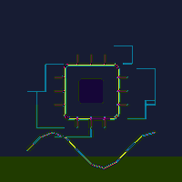

  

<h1 align="center">Igor Ilic</h1>

  <b>SMT Manufacturing Engineer · Industry 4.0</b>

  Building production-grade software for electronics manufacturing —
  from MES integrations and real-time OEE dashboards to AI-powered process optimization.

  
  

---

## Published Tools

| Repository | Description |
|---|---|
| [mcp-sql-server](https://github.com/gigimento/mcp-sql-server) | MCP server for natural-language SQL queries on MSSQL & SQLite |
| [smt-kpi-reporter](https://github.com/gigimento/smt-kpi-reporter) | Automated Excel KPI report generator from SQL/MES data |
| [smt-digital-twin-spc](https://github.com/gigimento/smt-digital-twin-spc) | SPC dashboard with real-time charts and AOI/SPI integration |
| [smt-downtime-tracker](https://github.com/gigimento/smt-downtime-tracker) | Real-time downtime tracking with Telegram alerting and KPI analytics |
| [msl-classification](https://github.com/gigimento/msl-classification) | MSL classification pipeline for electronic components |
| [component-intelligence-tool](https://github.com/gigimento/component-intelligence-tool) | AI-assisted component datasheet lookup and cross-referencing |
| [akytec-production-centar](https://github.com/gigimento/akytec-production-centar) | Streamlit-based SMT production dashboard with live OEE monitoring |
| [heller-profile-optimizer](https://github.com/gigimento/heller-profile-optimizer) | Reflow oven thermal profile optimizer with Groq-powered AI |
| [oee-enterprise-agent](https://github.com/gigimento/oee-enterprise-agent) | MCP agent for enterprise OEE data extraction and analysis |
| [command-centar-launcher](https://github.com/gigimento/command-centar-launcher) | Unified desktop launcher for 14+ manufacturing tools |

---

## Tech Stack

  
  
  
  
  
  
  
  
  
  
  

---

## Focus Areas

- **Surface-Mount Technology (SMT)** — production line software, reflow profiling, AOI/SPI analytics
- **Overall Equipment Effectiveness (OEE)** — real-time KPI pipelines, downtime analysis, shift reporting
- **MCP & AI Integration** — LLM-powered agents for manufacturing data access and analysis
- **Digital Twin & SPC** — statistical process control with live sensor data visualization

---

<i>tools for the factory floor · built by an engineer who works on it</i>

